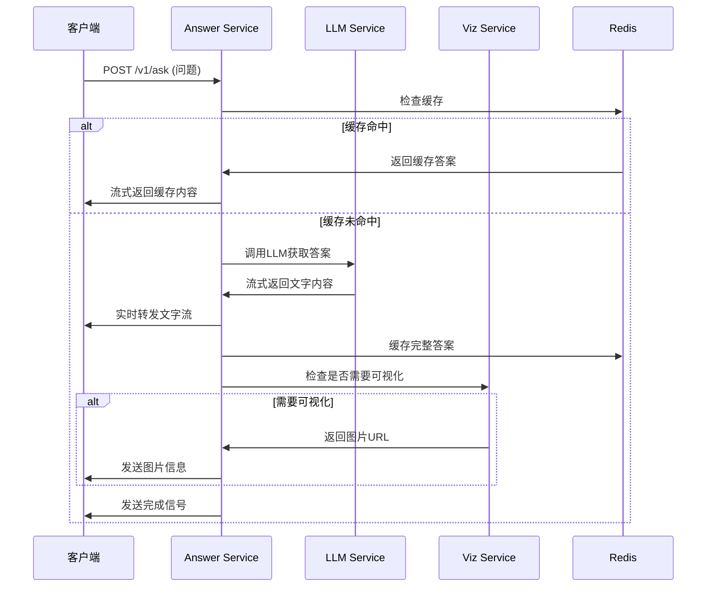

# 深学AI后端架构讲解

- Source Root: `agent资料`
- Source Path: `S2-系统训练营/4-大模型部署压测开发实战/深学AI/深学AI/深学AI后端架构讲解.md`
- Source Kind: `text`
- KB Type: `interview-topic`

# 深学AI后端代码详解教案

## 📚 教案目录
1. [项目概述与架构](#1-项目概述与架构)
2. [目录结构解析](#2-目录结构解析)
3. [核心概念理解](#3-核心概念理解)
4. [数据模型解析](#4-数据模型解析)
5. [服务层详解](#5-服务层详解)
6. [API接口实现](#6-api接口实现)
7. [数据流分析](#7-数据流分析)
8. [关键技术点](#8-关键技术点)
9. [实战演练](#9-实战演练)

---

## 1. 项目概述与架构

### 1.1 项目简介
深学AI是一个基于**微服务架构**的教育AI问答系统，主要特性包括
- 🎓 多学科支持（数学、语文、英语）
- 📊 数学可视化功能
- 🌊 流式输出响应
- 💾 Redis智能缓存
- 🐳 Docker容器化部署

### 1.2 整体架构图
```
┌─────────────────┐    ┌─────────────────┐    ┌─────────────────┐
│   Answer        │    │ Visualization   │    │     Redis       │
│   Service       │    │    Service      │    │   (缓存层)      │
│   (Port 8000)   │◄──►│   (Internal)    │    │   (Port 6379)   │
│ + Static Files  │    │                 │    │                 │
└─────────────────┘    └─────────────────┘    └─────────────────┘
        │                        │                        │
        └────────────────────────┼────────────────────────┘
                                 │
                    ┌─────────────────┐
                    │     Shared      │
                    │    Models &     │
                    │     Utils       │
                    └─────────────────┘
```

### 1.3 技术栈
- **FastAPI**: 现代化的Python Web框架
- **Pydantic**: 数据验证和序列化
- **Redis**: 内存数据库用于缓存
- **阿里云百炼API**: AI大语言模型服务
- **Docker**: 容器化部署

---

## 2. 目录结构解析

### 2.1 完整目录结构
```
shenxue_backend/shenxue-ai/
├── README.md                    # 项目说明文档
├── docker-compose.yml           # Docker编排文件
├── .env.example                 # 环境变量示例
├── Makefile                     # 构建脚本
├── nginx/                       # 反向代理配置
├── shared/                      # 共享模块
│   ├── models/                  # 数据模型
│   │   ├── request_models.py    # 请求数据模型
│   │   ├── response_models.py   # 响应数据模型
│   │   └── subject_models.py    # 学科相关模型
│   └── utils/                   # 工具函数
│       ├── constants.py         # 常量定义
│       ├── redis_client.py      # Redis客户端
│       └── http_client.py       # HTTP客户端
├── answer-service/              # 主问答服务
│   ├── Dockerfile              # 容器配置
│   ├── requirements.txt        # 依赖包列表
│   └── app/                    # 应用代码
│       ├── main.py             # 应用入口
│       ├── api/                # API路由
│       ├── core/               # 核心配置
│       └── services/           # 业务逻辑
└── viz-service/                # 可视化服务
    ├── Dockerfile              # 容器配置
    ├── requirements.txt        # 依赖包列表
    └── app/                    # 应用代码
```

### 2.2 目录职责说明

| 目录 | 职责 | 主要文件 |
|------|------|----------|
| `shared/` | 共享代码模块 | 数据模型、工具函数 |
| `answer-service/` | 核心问答服务 | API接口、业务逻辑 |
| `viz-service/` | 可视化生成服务 | 图表生成、图片处理 |
| `nginx/` | 反向代理配置 | 路由转发、静态文件 |

---

## 3. 核心概念理解

### 3.1 微服务架构
**什么是微服务？**
- 将大型应用拆分为多个小型、独立的服务
- 每个服务负责特定的业务功能
- 服务间通过网络通信

**本项目的微服务设计：**
```python
# answer-service: 主要问答逻辑
- 接收用户问题
- 调用AI模型获取答案
- 协调可视化服务
- 管理缓存策略

# viz-service: 可视化专门服务
- 检测是否需要生成图片
- 执行Python代码生成图表
- 返回图片URL
```

### 3.2 依赖注入模式
**目的**: 降低代码耦合度，提高可测试性

```python
# 在 dependencies.py 中
@lru_cache()
def get_llm_service() -> DashScopeService:
    """获取LLM服务实例"""
    return DashScopeService(...)

def get_answer_orchestrator() -> AnswerOrchestrator:
    """获取问答编排器实例"""
    return AnswerOrchestrator(
        llm_service=get_llm_service(),      # 注入LLM服务
        viz_client=get_viz_client(),        # 注入可视化客户端
        cache_service=get_cache_service()   # 注入缓存服务
    )
```

### 3.3 流式输出（SSE）
**Server-Sent Events**: 服务器主动向客户端推送数据
```python
# 流式响应的特点
- 实时性: 生成一部分就立即发送
- 用户体验: 避免长时间等待
- 数据格式: text/event-stream
```

---

## 4. 数据模型解析

### 4.1 请求模型 (request_models.py)

```python
class QuestionRequest(BaseModel):
    """问题请求模型"""
    subject: Optional[SubjectType] = Field(SubjectType.GENERAL, description="学科类型")
    text: Optional[str] = Field(None, description="问题文本")
    image_url: Optional[str] = Field(None, description="图片地址")
    stream: bool = Field(True, description="是否使用流式输出")
```

**设计要点解析:**
- `Optional`: 表示字段可选，增加API灵活性
- `Field`: 提供字段描述和默认值
- `BaseModel`: Pydantic基类，自动数据验证

### 4.2 响应模型 (response_models.py)

#### 完整响应模型
```python
class AnswerResponse(BaseModel):
    """完整答案响应模型"""
    # 核心字段（必须）
    success: bool                    # 是否成功
    text_answer: str                # 文字答案
    subject: SubjectType            # 学科类型
    processing_time: float          # 处理时间

    # 可视化字段（可选）
    has_visualization: bool = False  # 是否有图片
    image_url: Optional[str] = None  # 图片URL
    image_id: Optional[str] = None   # 图片ID
```

#### 流式响应模型
```python
class StreamResponse(BaseModel):
    """流式响应模型"""
    type: str      # 响应类型: text, image, error, done
    content: str   # 响应内容
    metadata: Optional[dict] = None  # 元数据
```

### 4.3 学科模型 (subject_models.py)

```python
# 学科类型枚举
class SubjectType(str, Enum):
    GENERAL = "general"  # 通用
    MATH = "math"       # 数学
    CHINESE = "chinese" # 语文
    ENGLISH = "english" # 英语

# 学科配置
SUBJECT_CONFIG = {
    SubjectType.MATH: {
        "name": "数学",
        "supports_visualization": True,  # 支持可视化
        "visualization_keywords": [      # 触发可视化的关键词
            "画", "图", "函数", "几何", "三角形"
        ]
    }
}
```

**为什么这样设计？**
- 枚举确保数据一致性
- 配置化管理学科特性
- 便于扩展新学科

---

## 5. 服务层详解

### 5.1 问答编排器 (AnswerOrchestrator)

**核心职责**: 协调各个服务，完成完整的问答流程

```python
class AnswerOrchestrator:
    def __init__(self, llm_service, viz_client, cache_service):
        self.llm_service = llm_service      # LLM服务
        self.viz_client = viz_client        # 可视化客户端
        self.cache_service = cache_service  # 缓存服务
```

#### 流式回答流程
```python
async def get_answer_stream(self, request: QuestionRequest):
    # 1. 检查缓存
    cached_answer = await self.cache_service.get_cached_answer(request)
    if cached_answer:
        # 模拟流式输出缓存答案
        for i in range(0, len(cached_answer), 10):
            yield cached_answer[i:i+10]
            await asyncio.sleep(0.01)  # 控制输出速度
        return

    # 2. 获取新答案
    full_answer = ""
    async for chunk in self.llm_service.get_answer_stream(request):
        full_answer += chunk
        yield chunk  # 实时输出

    # 3. 缓存成功的答案
    if full_answer and not self._is_error_response(full_answer):
        await self.cache_service.cache_answer(request, full_answer)
```

#### 关键设计模式
- **策略模式**: 根据不同情况选择缓存或新生成
- **生成器模式**: 使用`yield`实现流式输出
- **错误处理**: 只缓存成功的答案，避免错误传播

### 5.2 缓存服务 (CacheService)

**设计目标**: 提高响应速度，减少重复计算

```python
class CacheService:
    async def get_cached_answer(self, request: QuestionRequest) -> Optional[str]:
        """获取缓存的答案"""
        cache_key = self._generate_cache_key(request)
        return await self.redis_client.get(cache_key)

    async def cache_answer(self, request: QuestionRequest, answer: str):
        """缓存答案"""
        cache_key = self._generate_cache_key(request)
        await self.redis_client.setex(
            cache_key,
            self.default_ttl,  # 过期时间
            answer
        )

    def _generate_cache_key(self, request: QuestionRequest) -> str:
        """生成缓存键"""
        import hashlib
        content = f"{request.subject}:{request.text}:{request.image_url}"
        return f"answer:{hashlib.md5(content.encode()).hexdigest()}"
```

**缓存策略解析:**
- **键生成**: 基于问题内容生成唯一标识
- **TTL机制**: 设置过期时间，避免数据过时
- **选择性缓存**: 只缓存成功的回答

### 5.3 LLM服务 (DashScopeService)

**职责**: 与阿里云百炼API交互，获取AI回答

```python
class DashScopeService:
    async def get_answer_stream(self, request: QuestionRequest):
        """流式获取答案"""
        # 1. 构建请求消息
        messages = self._build_messages(request)

        # 2. 调用阿里云API
        async with httpx.AsyncClient() as client:
            async with client.stream(
                "POST",
                f"{self.base_url}/chat/completions",
                headers=self._get_headers(),
                json={
                    "model": self.model,
                    "messages": messages,
                    "stream": True  # 关键：启用流式
                }
            ) as response:
                # 3. 解析流式响应
                async for line in response.aiter_lines():
                    if line.startswith("data: "):
                        chunk = self._parse_stream_chunk(line)
                        if chunk:
                            yield chunk
```

---

## 6. API接口实现

### 6.1 主要接口分析

#### 核心问答接口 `/v1/ask`
```python
@router.post("/ask")
async def ask_question_stream(
    request: Optional[QuestionRequest] = None,  # JSON请求
    # 表单参数
    subject: Optional[str] = Form(None),
    text: Optional[str] = Form(None),
    image: Optional[UploadFile] = File(None),  # 文件上传
    orchestrator: AnswerOrchestrator = Depends(get_answer_orchestrator)
):
```

**接口设计亮点:**
1. **多种输入方式**: 支持JSON和表单上传
2. **文件处理**: 支持图片上传和URL
3. **参数验证**: 至少需要提供文本或图片
4. **依赖注入**: 自动注入业务逻辑组件

#### 流式响应实现
```python
if final_request.stream:
    return StreamingResponse(
        stream_answer(final_request, orchestrator),
        media_type="text/event-stream",
        headers={
            "Cache-Control": "no-cache",
            "Connection": "keep-alive",
        }
    )
```

### 6.2 SSE数据格式

```python
def format_sse_data(data: dict) -> str:
    """格式化SSE数据"""
    json_data = json.dumps(data, ensure_ascii=False)
    return f"data: {json_data}\n\n"

# 不同类型的SSE消息
{
    "type": "text",
    "content": "这是文字内容片段",
    "metadata": {"chunk_index": 1}
}

{
    "type": "image",
    "content": "/static/images/abc123.png",
    "metadata": {"image_id": "abc123"}
}

{
    "type": "done",
    "content": "处理完成",
    "metadata": {"total_time": 2.5}
}
```

---

## 7. 数据流分析

### 7.1 完整请求流程



### 7.2 错误处理流程

```python
# 多层错误处理
try:
    # 业务逻辑
    result = await process_business_logic()
except HTTPException:
    # HTTP层错误，直接抛出
    raise
except ValidationError as e:
    # 数据验证错误
    raise HTTPException(status_code=400, detail=str(e))
except Exception as e:
    # 未知错误，记录日志
    logger.error(f"Unexpected error: {e}")
    raise HTTPException(status_code=500, detail="内部服务器错误")
```

---

## 8. 关键技术点

### 8.1 异步编程模式

**为什么使用异步？**
- IO密集型应用（网络请求、数据库查询）
- 提高并发性能
- 避免阻塞等待

```python
# 异步函数定义
async def async_function():
    pass

# 异步调用
result = await async_function()

# 异步生成器
async def async_generator():
    for i in range(10):
        yield i
        await asyncio.sleep(0.1)  # 模拟异步操作

# 使用异步生成器
async for item in async_generator():
    print(item)
```

### 8.2 配置管理模式

```python
class Settings(BaseSettings):
    """使用Pydantic Settings进行配置管理"""
    DASHSCOPE_API_KEY: str                    # 必需配置
    REDIS_URL: str = "redis://localhost:6379" # 带默认值
    LOG_LEVEL: str = "INFO"                   # 环境变量

    class Config:
        env_file = ".env"  # 自动读取.env文件
        case_sensitive = True
```

### 8.3 中间件和依赖注入

```python
# CORS中间件
app.add_middleware(
    CORSMiddleware,
    allow_origins=["*"],
    allow_methods=["*"],
    allow_headers=["*"],
)

# 依赖注入
def get_service() -> MyService:
    return MyService()

@app.post("/endpoint")
async def endpoint(service: MyService = Depends(get_service)):
    return await service.process()
```

---

## 9. 实战演练

### 9.1 添加新学科支持

**任务**: 添加对"物理"学科的支持

**步骤1**: 修改学科枚举
```python
# shared/models/subject_models.py
class SubjectType(str, Enum):
    GENERAL = "general"
    MATH = "math"
    CHINESE = "chinese"
    ENGLISH = "english"
    PHYSICS = "physics"  # 新增物理
```

**步骤2**: 添加学科配置
```python
SUBJECT_CONFIG[SubjectType.PHYSICS] = {
    "name": "物理",
    "supports_visualization": True,
    "visualization_keywords": [
        "力", "运动", "电路", "波形", "实验", "图像"
    ]
}
```

**步骤3**: 测试新功能
```bash
curl -X POST http://localhost:8000/v1/ask \
  -H "Content-Type: application/json" \
  -d '{
    "subject": "physics",
    "text": "请画出自由落体运动的位移-时间图像",
    "stream": true
  }'
```

### 9.2 扩展缓存策略

**任务**: 实现基于用户的个性化缓存

**步骤1**: 修改缓存键生成
```python
def _generate_cache_key(self, request: QuestionRequest, user_id: str = None) -> str:
    content = f"{request.subject}:{request.text}"
    if user_id:
        content = f"user:{user_id}:{content}"
    return f"answer:{hashlib.md5(content.encode()).hexdigest()}"
```

**步骤2**: 添加用户相关的缓存管理
```python
async def get_user_cache_stats(self, user_id: str) -> Dict:
    """获取用户缓存统计"""
    pattern = f"answer:user:{user_id}:*"
    keys = await self.redis_client.keys(pattern)
    return {
        "user_id": user_id,
        "cached_questions": len(keys),
        "cache_size": sum([await self.redis_client.strlen(key) for key in keys])
    }
```

### 9.3 性能优化实践

**任务**: 实现请求去重和批处理

```python
class RequestDeduplicator:
    """请求去重器"""
    def __init__(self):
        self.pending_requests = {}

    async def get_or_wait(self, request_key: str, handler):
        """获取结果或等待正在处理的相同请求"""
        if request_key in self.pending_requests:
            # 相同请求正在处理，等待结果
            return await self.pending_requests[request_key]

        # 创建新的处理任务
        task = asyncio.create_task(handler())
        self.pending_requests[request_key] = task

        try:
            result = await task
            return result
        finally:
            # 清理完成的任务
            self.pending_requests.pop(request_key, None)
```

---

## 📝 学习总结

### 核心架构模式
1. **微服务架构**: 服务拆分、独立部署
2. **依赖注入**: 降低耦合、提高测试性
3. **异步编程**: 提高并发性能
4. **缓存策略**: 提升响应速度

### 技术要点
1. **FastAPI框架**: 现代Python Web开发
2. **Pydantic模型**: 数据验证和序列化
3. **流式输出**: 实时用户体验
4. **Redis缓存**: 高性能数据存储

### 最佳实践
1. **错误处理**: 多层异常捕获
2. **日志记录**: 便于问题排查
3. **配置管理**: 环境变量分离
4. **代码组织**: 清晰的模块划分

### 扩展方向
1. **监控告警**: 添加性能监控
2. **安全认证**: 用户权限管理
3. **负载均衡**: 高可用部署
4. **数据分析**: 使用统计和优化

---

1. **实践部署**: 尝试本地Docker部署
2. **代码调试**: 使用IDE断点调试
3. **API测试**: 使用Postman或curl测试
4. **性能分析**: 学习使用性能分析工具
5. **扩展功能**: 尝试添加新功能模块

通过这份教案，初学者可以系统地理解深学AI后端的整体架构和实现细节，为进一步的开发和优化打下坚实基础。
